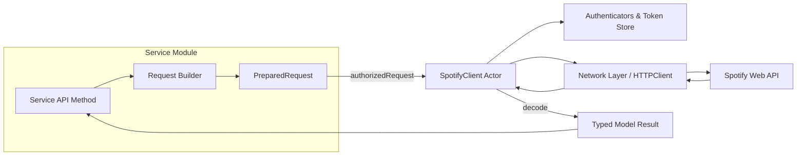

# Contributor Guide: Extending SpotifyKit

This guide gives new contributors a quick mental model for how `SpotifyClient` is structured and the exact steps for adding a new service surface area. It includes both visual diagrams and practical checklists so you can ramp up quickly.

## Architecture Snapshot

Every feature service follows the same pattern: a lightweight value type exposes domain-specific methods, builds `PreparedRequest` values with shared helpers, and delegates transport to the client actor.



Key takeaways:

1. **Services never hold state** – they only compose requests.
2. **Only `SpotifyClient` talks to the authenticator or HTTP layer.**
3. **Decoding happens centrally**, so services only provide the `Decodable` type they expect.

## Step-by-Step: Adding a New Service Method

Use the checklist below to create a production-ready endpoint. Keep the ASCII pipeline handy while you work.

```
┌──────────────────────────────────────────────────────────────┐
│ 1. Extend the service struct (e.g., AlbumsService).           │
│ 2. Define method signature and validate parameters.           │
│ 3. Build a PreparedRequest with FluentRequest helpers.        │
│ 4. Choose the decoding helper: .decode(...) or stream APIs.   │
│ 5. Add unit tests with SimpleMockHTTPClient or harness.       │
│ 6. Document the new method in DocC if it is public.           │
└──────────────────────────────────────────────────────────────┘
```

### Example Skeleton

```swift
public struct PlaylistsService {
    let client: SpotifyClient

    public func featured(
        limit: Int = 20,
        country: String? = nil
    ) async throws -> Page<Playlist> {
        try validateLimit(limit, in: 1...50)

        var request = client.get("/browse/featured-playlists")
            .query("limit", limit)
        if let country {
            request = request.query("country", country)
        }

        return try await client.requestJSON(request)
    }
}
```

### Testing Tips

- **Happy-path**: use `SimpleMockHTTPClient` with canned JSON.
- **Error branches**: leverage `StatusMockHTTPClient` or integration-style harnesses.
- **Pagination/streams**: `collectStreamItems` helpers in `Tests/Support/TestSupport.swift`.

Adding diagrams like the ones above to new docs is encouraged—visual context speeds up reviews and knowledge transfer.
