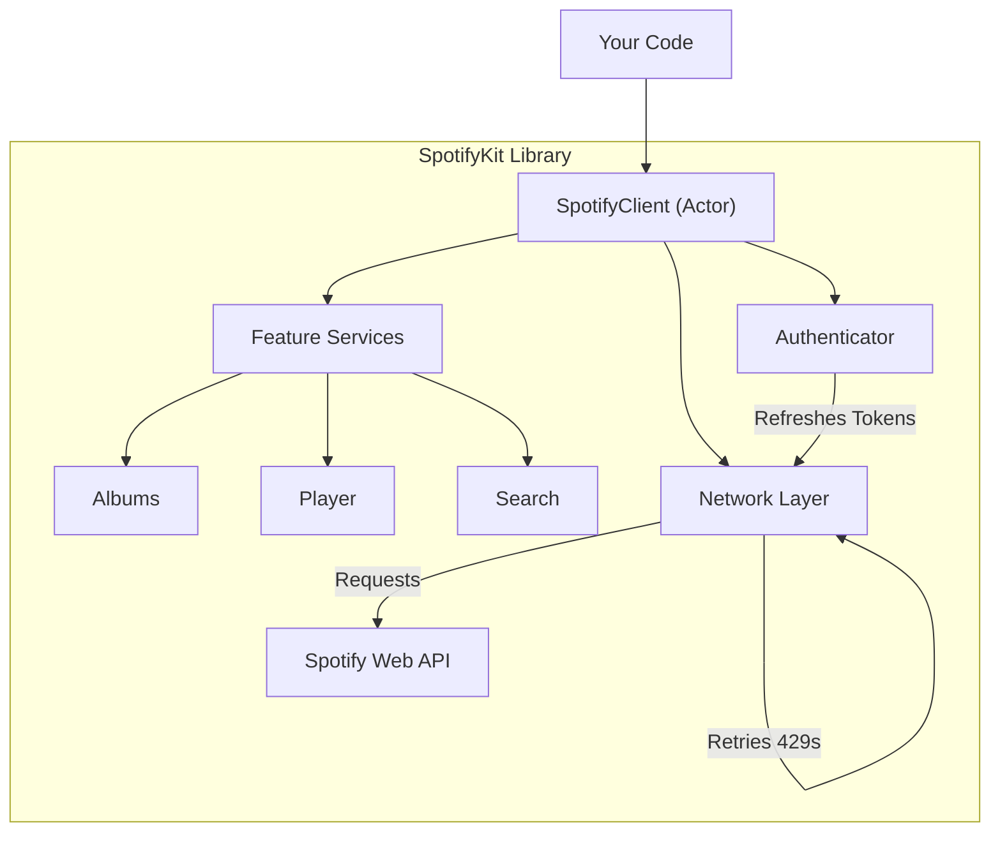
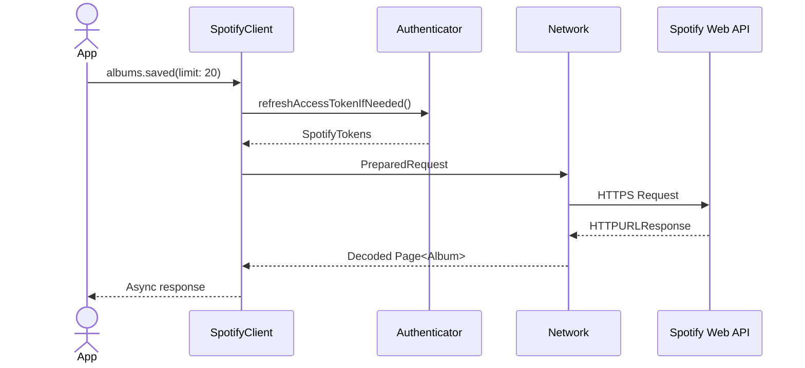

# SpotifyKit


**SpotifyKit** is a modern, thread-safe, and comprehensive Swift SDK for the Spotify Web API. Built with Swift 6 structured concurrency (Async/Await & Actors) from the ground up, it provides a fluent, type-safe interface for accessing the entire Spotify catalogue, managing user libraries, and controlling playback.

Designed for reliability, it handles the hard parts of API integration—token refreshing, rate limiting, and pagination—so you can focus on building your app.

## Documentation

Full API documentation is available here:
[**SpotifyKit Documentation**](https://dh85.github.io/SpotifyKit/documentation/spotifykit)

## Features

- ✅ **Modern Concurrency**: Built entirely with Swift 6 structured concurrency (Actors, Sendable).
- 🔒 **Thread-Safe**: `SpotifyClient` is an actor, ensuring safe concurrent access to tokens and resources.
- 🔎 **Fluent Search API**: Chainable, type-safe builders for complex search queries.
- 🛡️ **Resilient Networking**: Automatic rate limit handling (429 backoff), transparent token refreshing, and configurable retry logic.
- 📦 **Type-Safe Models**: Comprehensive Codable structs for Spotify objects (Albums, Artists, Tracks, etc.).
- 🐧 **Cross-Platform**: Fully compatible with iOS, macOS, and Linux.
- 📄 **Pagination Helpers**: AsyncSequences for streaming large collections of data effortlessly.
- 🔌 **Offline Mode**: Toggle network access for testing or low-data environments.
- ⚡ **Performance Optimised**: Uses modern Swift features like `consuming` parameters and Regex literals for maximum efficiency.
- 🔐 **Secure Token Storage**: Defaults to Keychain on Apple platforms and restricted-file storage on Linux; plug in your own `TokenStore` if you need envelope encryption.

## Requirements

- **Swift**: 6.1+
- **iOS**: 16.0+
- **macOS**: 13.0+
- **Linux**: Ubuntu 22.04+ (or compatible)

## Installation

### Swift Package Manager

Add the following to your `Package.swift` file:

```swift
dependencies: [
    .package(url: "https://github.com/dh85/SpotifyKit.git", from: "1.0.0")
]
```

## Quick Start

### 1. Initialize the Client

Create a client using one of the factory methods. For most apps, you'll use **PKCE** (User Auth) or **Client Credentials** (App Auth).

```swift
import SpotifyKit

// Option A: PKCE (Best for mobile/desktop apps)
let client = SpotifyClient.pkce(
    clientID: "your-client-id",
    redirectURI: URL(string: "your-app://callback")!,
    scopes: [.userReadPrivate, .userLibraryRead]
)

// Option B: Client Credentials (Best for backend services)
let client = SpotifyClient.clientCredentials(
    clientID: "your-client-id",
    clientSecret: "your-client-secret"
)
```

### 2. Make Requests

The API is organised into services (e.g., `.albums`, `.search`, `.player`).

```swift
// Search for tracks
let results = try await client.search
    .query("Bohemian Rhapsody")
    .forTracks()
    .execute()

if let track = results.tracks?.items.first {
    print("Found: \(track.name) by \(track.artistNames)")
}

// Get user's saved albums
let savedAlbums = try await client.albums.saved(limit: 5)
for item in savedAlbums.items {
    print("Saved: \(item.album.name)")
}

// Control Playback (Requires user auth)
try await client.player.play(uri: "spotify:track:...")
```

## Architecture

The library uses an Actor-based architecture to manage state safely across threads.

### High-Level Components



### Token & Request Lifecycle



### Layered View (ASCII)

```
+---------------------------+     +-----------------------------+
|   Your Feature / UI Layer | --> |   SpotifyClient (Actor)     |
+---------------------------+     +-----------------------------+
                                       |
                                       v
+---------------------------+     +-----------------------------+
|   Service APIs (albums,   | --> |   Networking & Auth Stack   |
|   playlists, search, ...) |     |   (Token store, retries)    |
+---------------------------+     +-----------------------------+
                                       |
                                       v
+---------------------------------------------------------------+
|                   Spotify Web API over HTTPS                  |
+---------------------------------------------------------------+
```

- **SpotifyClient**: The central actor. It holds the `TokenStore` and `Authenticator`.
- **Services**: Lightweight structs (e.g., `AlbumsService`) that expose specific API endpoints.
- **Network Layer**: Handles URLSession tasks, JSON decoding, and error mapping. It automatically intercepts 401 errors to refresh tokens and 429 errors to back off and retry.

## License

This project is licensed under the MIT License.

## Contributing

New to the codebase? Start with the [Contributor Guide](Docs/ContributorGuide.md) for architecture diagrams, checklists, and a “how to add a service” walkthrough.
